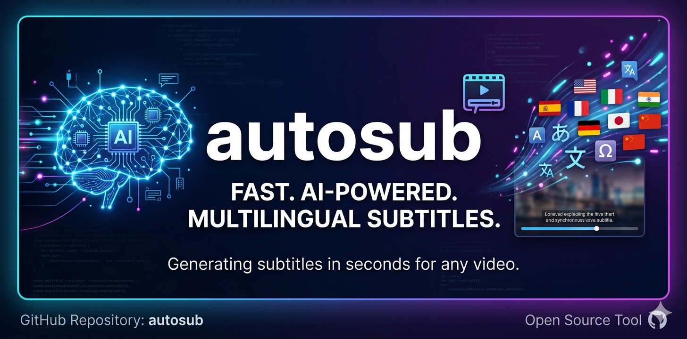

<p align="center">
  
</p>

<p align="center">
  <a href="https://www.python.org/">
    
  </a>
  <a href="https://groq.com/">
    
  </a>
  <a href="https://ffmpeg.org/">
    
  </a>
  <a href="https://github.com/AlexVitesse/autosub">
    
  </a>
  <a href="LICENSE">
    
  </a>
</p>

# AutoSub

Automatic subtitle generator with AI-powered translation. Extracts audio from video, transcribes with Whisper, and translates to multiple languages using LLM — all through Groq's fast inference API.

## Features

- **Fast transcription** — Groq Whisper processes a 99-min movie in ~2 minutes
- **Word-level timestamps** — Accurate subtitle timing from Whisper
- **Multi-language translation** — Translate to 16+ languages using Llama 3.3 70B
- **Smart filtering** — Removes Whisper hallucinations, garbage text, and non-speech artifacts
- **API key rotation** — Automatically rotates between multiple Groq keys on rate limits
- **Translation verification** — Detects untranslated lines and retries them
- **GUI + CLI** — Desktop interface or command-line, your choice

## How It Works

```
Video (MP4) → ffmpeg (extract audio) → Groq Whisper (transcribe)
    → Segment into subtitles → Generate SRT (original language)
    → Groq LLM (translate) → Generate SRT (translated)
```

## Requirements

- **Python 3.10+**
- **ffmpeg** installed and available in PATH ([download](https://ffmpeg.org/download.html))
- **Groq API key** — Free at [console.groq.com](https://console.groq.com/keys)

## Installation

```bash
git clone https://github.com/AlexVitesse/autosub.git
cd autosub

python -m venv venv
# Windows
venv\Scripts\activate
# Linux/Mac
source venv/bin/activate

pip install -r requirements.txt
```

## Configuration

Copy the example environment file and add your API key:

```bash
cp .env.example .env
```

Edit `.env`:

```env
GROQ_API_KEYS="gsk_your_key_here"
```

You can add multiple keys separated by commas for automatic rotation when rate limits are hit:

```env
GROQ_API_KEYS="gsk_key1,gsk_key2,gsk_key3"
```

### Environment Variables

| Variable | Default | Description |
|----------|---------|-------------|
| `GROQ_API_KEYS` | — | Groq API keys (comma-separated) |
| `WHISPER_MODEL` | `whisper-large-v3-turbo` | Whisper model for transcription |
| `GROQ_MODEL` | `llama-3.3-70b-versatile` | LLM model for translation |
| `SOURCE_LANGUAGE` | `en` | Source video language code |
| `TARGET_LANGUAGE` | `es` | Default target language code |

## Usage

### GUI

```bash
python gui.py
```

1. Click **Examinar** to select a video file
2. Choose the video's source language
3. Check the languages you want to translate to
4. Click **Generar Subtitulos**
5. SRT files are saved next to the original video

### CLI

```bash
# Explicit path
python subtitle_creator.py path/to/video.mp4

# Auto-detect from videos/ folder
python subtitle_creator.py
```

Output files are saved next to the source video:
- `video.srt` — Original language subtitles
- `video_es.srt` — Spanish translation
- `video_fr.srt` — French translation (if selected)

## Supported Languages

| Code | Language | Code | Language |
|------|----------|------|----------|
| en | English | ja | Japanese |
| es | Spanish | ko | Korean |
| fr | French | zh | Chinese |
| de | German | ru | Russian |
| pt | Portuguese | ar | Arabic |
| it | Italian | hi | Hindi |
| nl | Dutch | pl | Polish |
| tr | Turkish | sv | Swedish |

## Project Structure

```
autosub/
├── gui.py                 # Desktop GUI (tkinter)
├── subtitle_creator.py    # Core pipeline + CLI
├── config.py              # Configuration from environment
├── requirements.txt       # Python dependencies
├── .env.example           # Environment template
└── videos/                # Default video input folder
```

## Limitations

- Subtitle accuracy depends on audio quality and Whisper's capabilities
- Translation quality varies by language pair — always review generated subtitles
- Groq free tier has rate limits; multiple API keys help mitigate this
- Very long videos (3+ hours) may need chunked processing

## License

MIT
